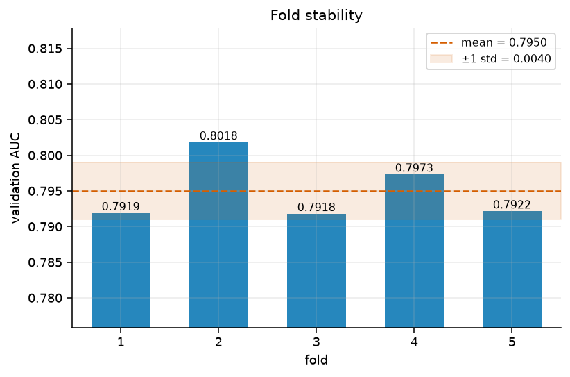
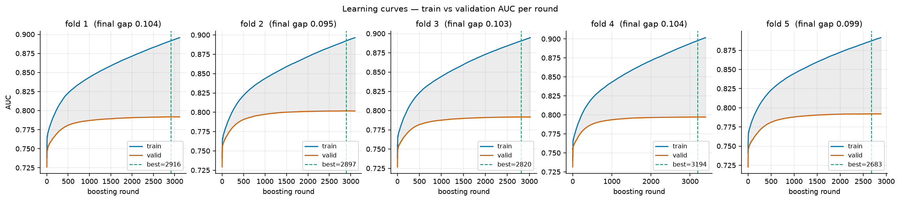
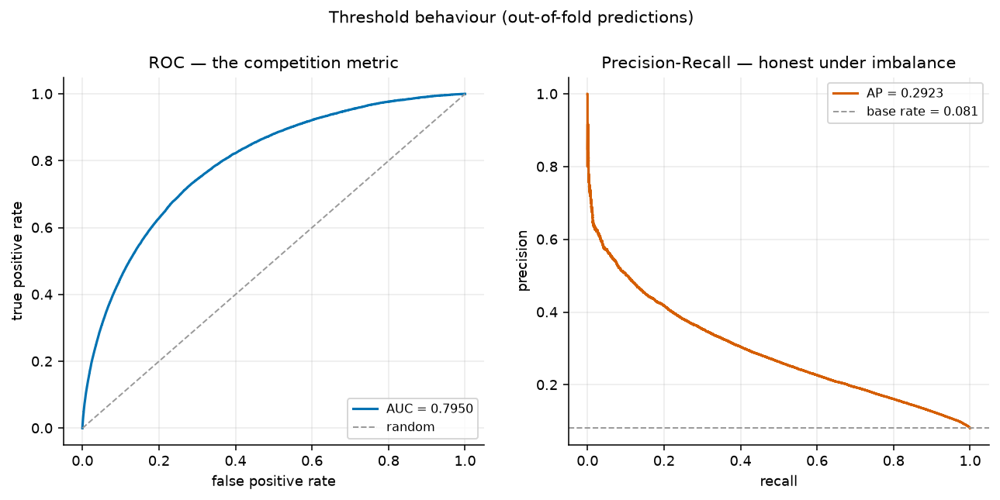
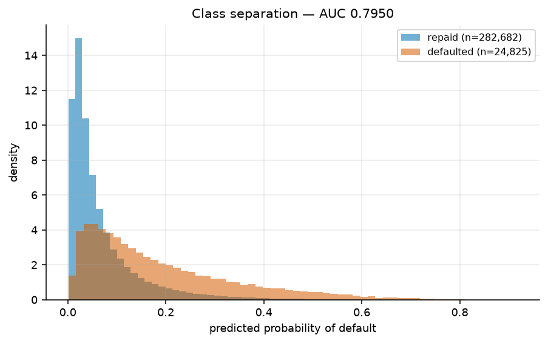
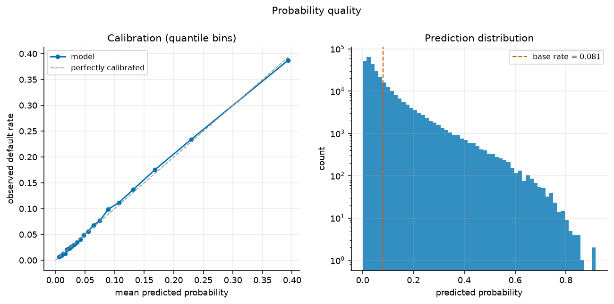
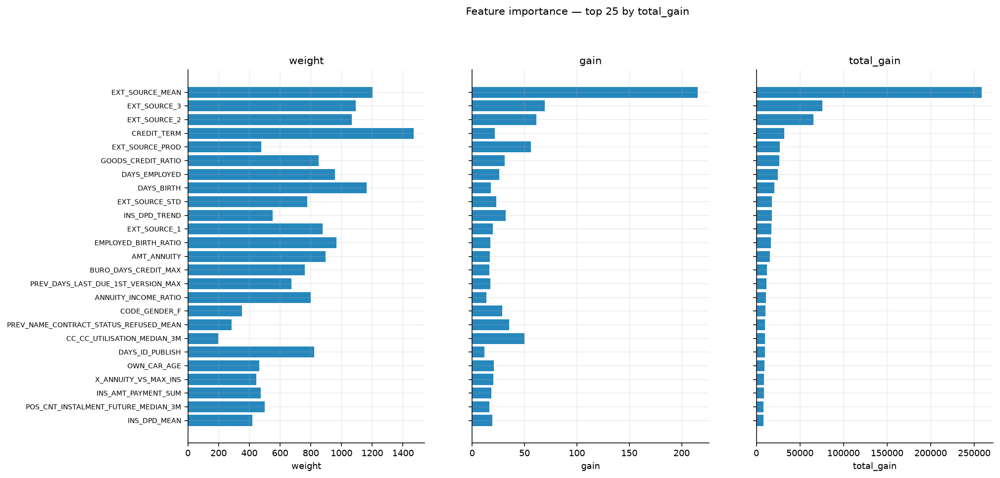
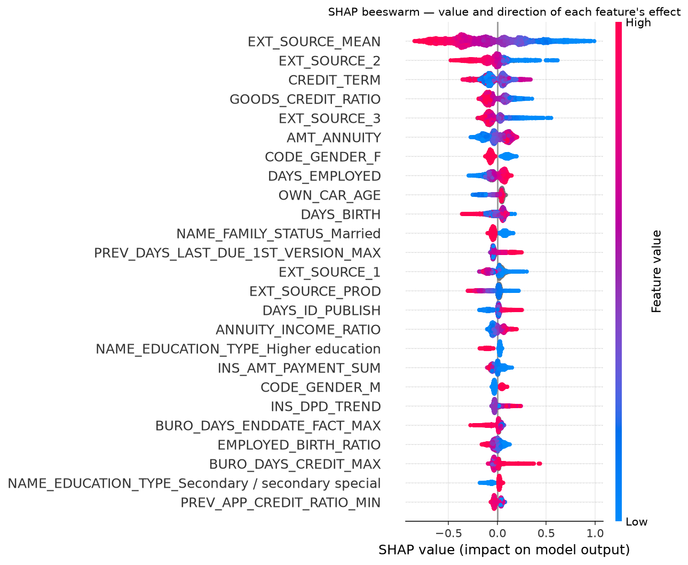
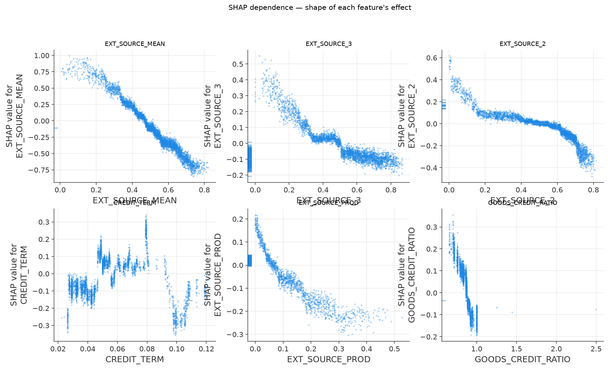

# Home Credit Default Risk - an XGBoost walkthrough

Kaggle Competition [Home Credit Default Risk](https://www.kaggle.com/competitions/home-credit-default-risk)

**Result: CV AUC 0.79501, private LB 0.79606.** First place was 0.8057.

---

## 1. The problem

Home Credit lends to people with little or no traditional credit history. The
task is to predict, for each loan applicant, whether they will default - scored
by **ROC AUC** on a hidden test set.

Two facts about the target drive nearly every decision downstream:

**Only 8.07% of applicants default.** Accuracy is therefore worthless as a
metric: predicting "nobody defaults" scores 91.9% and is useless. AUC instead
measures *ranking* quality - given a random defaulter and a random non-defaulter,
how often does the model score the defaulter higher? Because only the ranking
matters, predictions are never thresholded into 0/1; the submission carries raw
probabilities and only their order affects the score.

**The signal is genuinely weak.** Default is partly a random human event - job
loss, illness, divorce. The winning solution reached 0.8057, and the gap between
a good model (0.79) and the world's best (0.805) is about 0.015 AUC. That
ceiling is the context for every result below.

## 2. The data: seven tables, one row per applicant

The central difficulty is structural, not statistical. XGBoost needs a
rectangular matrix with **exactly one row per applicant**, but only one of the
seven tables is shaped that way.

| Table | Grain | Key | Rows |
|---|---|---|---|
| `application_{train,test}` | one per applicant | `SK_ID_CURR` | 307,511 / 48,744 |
| `bureau` | one per external loan | `SK_ID_CURR`, `SK_ID_BUREAU` | 1.7M |
| `bureau_balance` | monthly per external loan | `SK_ID_BUREAU` | 27M |
| `previous_application` | one per prior HC application | `SK_ID_PREV`, `SK_ID_CURR` | 1.7M |
| `POS_CASH_balance` | monthly per prior loan | `SK_ID_PREV` | 10M |
| `installments_payments` | one per installment paid | `SK_ID_PREV` | 13.6M |
| `credit_card_balance` | monthly per prior card | `SK_ID_PREV` | 3.8M |

2.7 GB of CSV, and the target lives only in `application_train`. Every other
table has many rows per applicant - one per external loan, one per monthly
snapshot, one per payment made.

So every auxiliary table goes through the same three steps ([features.py](src/features.py)):

1. **one-hot encode** its categorical columns, so they can be averaged
2. **`groupby(SK_ID_CURR).agg([...])`**, collapsing to one row per applicant
3. **left-join** the result onto the application frame

This *aggregate-then-join* pattern is the whole competition. `bureau_balance` is
the one exception requiring two levels - it has no `SK_ID_CURR` at all, so it
aggregates to the loan first, joins through `bureau`, then aggregates again to
the applicant.

**Why aggregation captures signal.** A single applicant may have 30 installment
payments. Any one payment says little, but `mean(days_late)` says whether they
habitually pay late and `max(days_late)` gives their worst-ever delinquency.
Those summaries are what the model can learn from. Five statistics -
mean, max, min, sum, std - are applied to most numeric columns, so each source
column expands into five features.

**Left joins, and NaNs are never filled.** An applicant absent from a table
(no credit history at all) keeps their row with NaN features. XGBoost learns a
default branch direction for missing values at every split, and *"this person has
no bureau record"* is itself a risk signal that imputation would erase.

### Two data traps worth naming

**`DAYS_EMPLOYED == 365243`** is a missing-value sentinel. The column holds
negative day offsets from the application date, so left in place that value
reads as roughly **+1000 years** - a massive outlier dragging split thresholds
away from the real data. The same sentinel appears in five `previous_application`
day columns. All are replaced with NaN.

**Division by zero produces `inf`, and XGBoost refuses to train on it.**
`AMT_CREDIT` is 0 on ~337k cancelled applications, and 290 installment rows have
`AMT_INSTALMENT == 0`. Both feed ratio features. This crashed the first full
training run - and, importantly, was *invisible* at `--nrows 20000`, because
`--nrows` truncates each table to its first N rows and the pathological rows sat
further down. Each divide is now guarded at its definition site, with a global
`inf → NaN` sweep in `build()` as a safety net.

## 3. Feature engineering

Two layers, built in [features.py](src/features.py).

### Hand-built ratios

Raw amounts are weak predictors because the same loan means different things at
different income levels - a $50k loan is routine on a $200k income and alarming
on a $20k one. Encoding ratios directly saves the model from rediscovering them
through splits: `CREDIT_INCOME_RATIO`, `ANNUITY_INCOME_RATIO`, `CREDIT_TERM`
(annuity/credit, approximating loan term), `EMPLOYED_BIRTH_RATIO` (fraction of
life spent in the current job), `INCOME_PER_PERSON`, `GOODS_CREDIT_RATIO`.

`EXT_SOURCE_1/2/3` are normalised external credit scores and consistently the
strongest features in this dataset. Combining them adds information beyond the
three raw columns: the **mean** is a more stable consensus, the **std** flags
applicants the agencies disagree about, and the **product** is a sharp
non-linear interaction.

### Time-aware features - the part that moved the score

Lifetime aggregates flatten a customer's whole history into one number, which
hides the most predictive thing in the data: **someone who paid perfectly for
four years and started slipping last quarter has the same lifetime mean as a
steady payer.** Four feature groups address that.

**Recency windows** (`*_MEDIAN_3M`, `_6M`, `_12M`, `_24M`) recompute behavioural
columns over trailing windows. Median, not mean - payment tables are
heavy-tailed, and one settlement payment or a single 300-day delinquency drags a
mean away from typical behaviour, especially in a 3-month window holding only a
few rows.

**Window deltas** (`*_DELTA_3_6M`) subtract an older window from a newer one.
Positive on a lateness column means the customer is slipping. A raw window
median says what someone did recently; recent-minus-older says whether they are
getting *better or worse*, which is the actual risk signal.

**Trends** (`*_TREND`) fit a least-squares slope against time per customer, so
direction of travel becomes one number. Computed closed-form as
covariance/variance rather than `np.polyfit` per group - the latter is
prohibitively slow across ~300k groups, while this is a handful of vectorised
groupby passes. Customers with fewer than 3 observations get NaN, since a slope
through two points is noise.

**Cross-table ratios** (`X_*`) combine an application column with an aggregate
from another table, so they can only be built after all joins. Total external
debt is meaningless alone; debt-to-income *across all lenders* says whether the
applicant is already over-extended before this loan is granted. Likewise
`X_ANNUITY_VS_MAX_INS` - the new annuity against the largest installment they
have ever sustained. Well above 1 means this loan asks more of them than
anything in their track record.

| Group | Count |
|---|---|
| Window medians | 44 |
| Window deltas | 33 |
| Trends | 11 |
| Cross-table ratios | 8 |

**Feature count: 1,674 → 1,775.** Build time ~65s.

## 4. The model

XGBoost, 5-fold stratified CV ([train.py](src/train.py)).

```python
"objective":        "binary:logistic",  # calibrated probabilities in [0,1]
"eval_metric":      "auc",              # early-stop on the competition metric
"tree_method":      "hist",             # binned splits; ~1,775 features x 300k rows
"eta":              0.02,               # low LR + many rounds + early stopping
"max_depth":        6,                  # ~6-way interactions; deeper memorises
"min_child_weight": 40,                 # main anti-overfit lever at an 8% positive rate
"subsample":        0.85,
"colsample_bytree": 0.7,                # decorrelates near-duplicate aggregates
"reg_alpha":        0.1,                # L1: weak weights to exactly zero
"reg_lambda":       1.0,
```

The choices that matter most here:

**Low `eta` with early stopping.** Each tree contributes a small correction, so
the ensemble approaches the signal gradually rather than chasing noise. On data
this noisy, a higher learning rate overfits before the aggregated features have
paid off. `num_boost_round=5000` is an upper bound, not a target - training ends
when validation AUC stops improving for 200 rounds, so the data picks the tree
count.

**`min_child_weight=40`.** With only ~8% positives, this is the main guard
against carving out tiny leaves that fit a handful of defaulters by coincidence.

**`colsample_bytree=0.7`** matters more than usual here, because many aggregate
features are near-duplicates (`INS_DPD_MEAN` vs `INS_DBD_MEAN`). Without column
subsampling every tree would keep reaching for the same dominant columns.

**Stratified folds** preserve the ~8% default rate inside every fold. Plain
`KFold` would let fold base rates drift apart by chance, adding variance to the
CV estimate and making folds non-comparable.

**The out-of-fold vector is the key artefact.** Each row is predicted by the one
model that did *not* train on it, so `roc_auc_score(y, oof)` is an honest
estimate over the full training set. It is saved to `output/oof.npy` because it
is also exactly what a later blending layer needs. Test predictions are averaged
across the five fold models - a mild ensemble that reliably beats any single
fold's model.

### Hyperparameter search

[tune.py](src/tune.py) runs Optuna's TPE sampler. A grid over 6 parameters at 4
values each is 4,096 fits, which is impossible on a laptop at several minutes
per fit; Bayesian search models which regions produced good scores and
concentrates trials there.

A 40-trial run on 60k rows took **24 minutes**, of which **15 trials were
pruned** - MedianPruner reports the running mean after each fold and aborts
configurations already below the median, which is where most of the wall-clock
saving comes from. Best trial (#33, of 25 completed) reached 0.757975 on the
reduced setup, against 0.752723 for the worst - a spread of only **0.005**.

That narrow spread is the finding. **Hyperparameters were worth far less than
features here**: the time-aware feature groups moved the private LB by 0.0026
while the entire searched parameter space spanned 0.005 on a reduced setup. The
tuned configuration favours a deeper tree (`max_depth=8`) with much heavier
regularisation (`min_child_weight≈84`, `eta≈0.010`) - a different balance point
than the hand-set defaults, not a dramatically better one.

Search defaults trade fidelity for speed (3 folds, a row subsample). The
*ranking* of configurations is stable under those reductions even though
absolute AUC is lower, which is all the search needs. Re-validate the winner
with a full 5-fold run via `--use-tuned`.

## 5. Results

**CV AUC 0.79501, private LB 0.79606** - 307,507 rows x 1,775 features, ~24 min.

The competition closed in 2018, so late submissions **score but stay unranked**.
Both LB figures are still computed against the real hidden labels: public uses
~20% of the test set, private the other ~80%.

| Run | Features | CV | Public LB | Private LB |
|---|---|---|---|---|
| application table only | ~240 | ~0.74 | | |
| Baseline (all tables aggregated) | 1,674 | 0.79316 | 0.79506 | 0.79345 |
| **+ time-aware features** | **1,775** | **0.79501** | 0.79754 | **0.79606** |
| 1st place private LB | | | | 0.8057 |

The time-aware features gained **+0.0026 on the private LB** - confirmed on
held-out data, not just CV. `INS_DPD_TREND` (slope of payment lateness over
time) ranks 9th of 1,775 by gain, so deterioration in payment behaviour was
genuinely missing from the lifetime aggregates.

**CV tracks the private LB to within 0.001 and slightly understates it.** So
iterate against CV and submit only to confirm. **Trust CV over the public LB** -
the public split is only ~9,700 rows and its noise is comparable to the fold
spread, so chasing it means fitting noise.

### How much of a difference is real?

Per-fold: 0.7919 / 0.8018 / 0.7918 / 0.7973 / 0.7922 - mean 0.7950, **std
0.0040**. Fold 2 sits ~0.006 above the others, so it is an easier split rather
than the model being unstable.

The practical consequence governs every experiment: **treat gains under ~0.004
as unproven** until confirmed on the LB or across multiple seeds.



### Is it overfitting?

Validation plateaus around round 1000 while training keeps climbing to a final
gap of ~0.10. Everything after the plateau is memorisation, not learning. Early
stopping still runs to ~2,800 rounds because validation AUC technically drifts
up by tiny amounts, so most of those trees buy almost nothing. A larger
`min_child_weight` or lower `max_depth` would close the gap; whether that helps
AUC is worth testing.



### What the score means operationally

ROC AUC 0.7950 is the competition metric, but the PR curve is the honest one.
Average precision is **0.2923 against a 0.081 base rate** - roughly 3.6x better
than random, yet precision falls below 0.4 by 25% recall. **Catching most
defaulters means accepting many false positives**, a fact the ROC curve's large
false-positive denominator hides.



Drawing class separation directly shows what AUC measures. The blue spike below
0.05 is a large block of applicants the model confidently and correctly clears.
The orange tail reaches 0.8, so genuine high-risk cases are found. The overlap
between 0.05 and 0.25 is where the remaining error lives - and much of it is
irreducible.



The model also sits essentially **on the calibration diagonal** across the whole
range. Predicted probabilities are usable as actual probabilities, not just as a
ranking, which matters if the scores ever feed expected-loss pricing. Note that
AUC is invariant to any monotone transform, so this is information the
competition metric simply cannot tell you.



### What the model learned

Three importance measures, read together. `weight` (split count) is biased
toward high-cardinality continuous features, which offer many candidate split
points regardless of usefulness. `gain` says how much a feature helps *when
used*. `total_gain` combines both and is usually the most honest single ranking.
A feature high on gain but low on total_gain is a specialist - very useful in the
rare cases it applies.



Top features by mean gain across folds:

| # | Feature | Gain |
|---|---|---|
| 1 | `EXT_SOURCE_MEAN` | 204.6 |
| 2 | `BURO_CREDIT_ACTIVE_CLOSED_MAX` | 90.4 |
| 3 | `EXT_SOURCE_3` | 67.8 |
| 4 | `EXT_SOURCE_2` | 56.1 |
| 5 | `CC_CC_UTILISATION_MEDIAN_3M` | 52.7 |
| 6 | `EXT_SOURCE_PROD` | 52.6 |
| 7 | `NAME_EDUCATION_TYPE_Higher education` | 50.7 |
| 8 | `PREV_CODE_REJECT_REASON_SCOFR_SUM` | 38.7 |
| 9 | `INS_DPD_TREND` | 33.4 |
| 10 | `PREV_REFUSED_RATE` | 31.3 |

Three things stand out. The **external credit scores dominate** - the engineered
`EXT_SOURCE_MEAN` outranks all three raw columns, confirming the consensus is
more stable than any single agency. **Home Credit's own prior rejections**
(`PREV_CODE_REJECT_REASON_SCOFR_SUM`, `PREV_REFUSED_RATE`) rank high, because
they encode risk assessments the lender already made about this person. And
**three of the top ten are time-aware features** (`CC_CC_UTILISATION_MEDIAN_3M`,
`INS_DPD_TREND`, plus the 6M utilisation window just below), which is the direct
evidence behind the +0.0026 gain.

Gain says a feature was useful but not *which way* it pushed the prediction.
SHAP assigns every feature a signed contribution per row, so high
`EXT_SOURCE_MEAN` visibly sits left of zero - pushing risk down.



The dependence plots show the *shape* of each effect, which the beeswarm
compresses away. `EXT_SOURCE_MEAN` is cleanly monotonic and near-linear, so the
model treats it as a smooth risk scale. `EXT_SOURCE_3` instead shows a step near
0.3 and a plateau past 0.5 - a threshold the trees discovered, beyond which more
score buys nothing. `CREDIT_TERM` is jagged and non-monotonic, the signature of
a feature the model splits on repeatedly *in interaction* with others rather
than reading off directly.

Vertical stripes at the far left of several panels are the NaN rows, which SHAP
places separately - visible confirmation that missingness carries its own
attribution rather than being silently imputed.



## 6. The code

```
data/      10 CSVs, 2.7 GB (gitignored)
src/
  features.py     table aggregation -> feature matrix
  train.py        stratified 5-fold CV + submission
  diagnostics.py  evaluation and validation plots
  tune.py         Optuna hyperparameter search + analysis plots
output/
  submission_*.csv     one per run, CV score in the filename
  oof.npy              out-of-fold predictions (input for blending)
  importance_*.csv     weight / gain / total_gain, and mean |SHAP|
  best_params.csv      winner of the last tuning run
  tuning_trials.csv    every trial, for comparing successive searches
  plots/               all figures
```

### Setup

Dependencies are declared in `pyproject.toml` and installed into a uv-managed
`.venv` (native arm64, Python 3.12):

```bash
uv sync
source .venv/bin/activate   # then plain `python ...`
# or, without activating: uv run python src/train.py
```

### Running

```bash
# fast smoke test (~30s) - exercises the whole pipeline including plots
python src/train.py --nrows 30000 --folds 3 --rounds 150 --shap-sample 800

# full run (~24 min, plus ~2 min for SHAP)
python src/train.py

# skip diagnostics while iterating on features
python src/train.py --no-plots

# hyperparameter search, then retrain with the winner
python src/tune.py --trials 40 --nrows 60000
python src/train.py --use-tuned
```

### The diagnostics

`train.py` writes these to `output/plots/` unless `--no-plots` is passed. Each
answers one question a single CV number cannot.

| Plot | Question it answers |
|---|---|
| `01_learning_curves` | Overfitting? Stopped too early? Train/valid gap per fold |
| `02_importance_comparison` | weight vs gain vs total_gain, side by side |
| `03_shap_beeswarm` | Which features matter, and in which **direction** |
| `04_shap_bar` | Mean \|SHAP\| ranking, comparable to gain |
| `05_shap_dependence` | Shape of each top feature's effect |
| `06_roc_pr` | ROC (the metric) and PR (honest under imbalance) |
| `07_calibration` | Are probabilities meaningful, or only rankings? |
| `08_score_distribution` | Class separation - what AUC measures, drawn |
| `09_fold_stability` | Is the CV number trustworthy? |

`tune.py` adds four interactive Optuna HTML figures - open them in a browser:

| Plot | Question it answers |
|---|---|
| `10_tuning_history` | Has the search converged? |
| `11_param_importance` | Which parameters actually matter |
| `12_slice` | Score vs value per parameter; catches too-narrow ranges |
| `13_parallel_coordinate` | Which **combinations** work |
| `14_contour` | Pairwise interaction surfaces |

SHAP runs last in `run_all()` because it is by far the slowest step, so a failure
there still leaves every cheaper plot on disk. It explains **held-out validation
rows**, never training rows.
